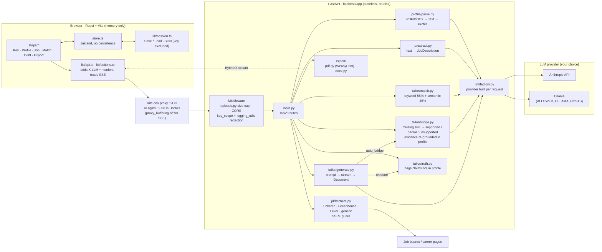

# TailorUrResume

A bring-your-own-key, fully **stateless** AI resume and CV tailor. Upload your resume, point it at a job
(paste the text or give a URL), and get a tailored resume, full CV and cover letter, with a truthfulness
check that flags any claim not traceable to your profile. Export to PDF or DOCX.

- **Backend:** FastAPI (Python 3.11+), no database, no disk writes, no server-side sessions or caches.
- **Frontend:** Vite, React, TypeScript, Tailwind, Radix primitives, Framer Motion, Zustand (no persistence).
- **Providers:** Anthropic (your API key) or a local Ollama model.

## Architecture



Where each step happens:

| Step | Frontend | Endpoint | Backend | LLM |
| --- | --- | --- | --- | --- |
| 1. Key | `steps/KeyStep.tsx` | `POST /api/test-connection` | `llm/factory.py` builds the provider from `X-LLM-*` headers and pings it | yes |
| 2. Profile | `steps/ProfileStep.tsx`, `components/ProfileEditor.tsx` | `POST /api/profile/parse` | `uploads.py` parses multipart in memory, `profile/parse.py` extracts text and structures it via `complete_json` | yes |
| 3. Job | `steps/JobStep.tsx` | `POST /api/jd/fetch`, `POST /api/jd/extract` | `jd/fetchers.py` fetches the posting (no LLM), `jd/extract.py` turns text into a `JobDescription` | extract only |
| 4. Match | `steps/MatchStep.tsx`, `components/GapPopover.tsx` | `POST /api/match`, `POST /api/bridge` | `tailor/match.py` scores coverage + semantic fit, `tailor/bridge.py` judges missing skills against existing experience | yes |
| 5. Craft | `steps/CraftStep.tsx`, `lib/actions.ts`, `components/DiffView.tsx` | `POST /api/generate` (SSE), `POST /api/regenerate-bullet`, `POST /api/check-truth` | `tailor/generate.py` streams `bridge` / `token` / `warning` / `done` events, `tailor/truth.py` flags unverified claims | yes (truth check is heuristic) |
| 6. Export | `steps/ExportStep.tsx`, `components/TemplatePicker.tsx` | `POST /api/export/{pdf,docx}` | `export/pdf.py` (HTML template + WeasyPrint) or `export/docx.py`, built in `BytesIO` | no |

All state (profile, jobs, match results, documents) lives in the browser store and is sent with each request;
the backend keeps nothing between calls. LLM JSON goes through `LLMProvider.complete_json` in `llm/base.py`
(one repair retry, errors surface as `LLMError`).

## Statelessness and privacy

- Uploads are parsed in memory; exports are built in `BytesIO` and streamed back.
- Your API key lives only in React memory and is sent per request in the `X-LLM-Key` header. The Anthropic
  client is built per request. The key is redacted from logs by a logging filter and is never echoed in a response.
- The browser stores nothing: no `localStorage`, `sessionStorage` or cookies. Refresh the tab and everything is gone
  (a `beforeunload` warning protects unsaved work). Use **Save session** to download a JSON file (the key is excluded)
  and **Load session** to resume.
- Your resume and the job text are sent to the LLM provider you choose (Anthropic, or your own Ollama).

## Features

Key setup and connection test, profile parsing (PDF/DOCX) into an editable structure, job intake via **Paste** or **URL**,
match score (keyword coverage + semantic fit) with matched/missing skills, streamed generation of resume, CV and cover
letter, in-place editing, per-bullet regeneration, original-vs-tailored diff, truthfulness guard, three ATS-friendly
templates, PDF and DOCX export, multiple jobs per session with score comparison, and a command palette (Cmd/Ctrl+K).

### Job URLs

| Source | How it is fetched |
| --- | --- |
| LinkedIn | Public guest endpoint `linkedin.com/jobs-guest/jobs/api/jobPosting/<id>`; id from `/jobs/view/<id>` or `currentJobId=<id>` |
| Greenhouse | `boards-api.greenhouse.io/v1/boards/<board>/jobs/<id>` |
| Lever | `api.lever.co/v0/postings/<company>/<id>` |
| Anything else | Generic readable-text extraction (JSON-LD `JobPosting` first, then page text) |

If a fetch fails, the app switches to the Paste tab with a notice. Private and local addresses are refused (SSRF guard).

> **LinkedIn Terms of Service caveat.** The LinkedIn guest endpoint is unofficial and may be rate limited or blocked at
> any time. Automated or bulk scraping of LinkedIn violates its Terms of Service. TailorUrResume fetches a posting only
> when you explicitly click **Fetch**, one URL at a time, and caches nothing. Use it for postings you could open yourself,
> and prefer pasting the text if you are unsure.

## Run locally

Backend:

```bash
cd backend
python -m venv .venv && source .venv/bin/activate
pip install -r requirements.txt -r requirements-dev.txt
uvicorn app.main:app --reload --port 8000
curl localhost:8000/health
```

PDF export uses WeasyPrint, which needs Pango. On Debian/Ubuntu: `sudo apt install libpango-1.0-0 libpangoft2-1.0-0 libharfbuzz-subset0 fonts-dejavu-core`
(macOS: `brew install pango`). If the libraries are missing, `/api/export/pdf` responds with a clear 503 and DOCX export keeps working.

Frontend:

```bash
cd frontend
npm install
npm run dev        # http://localhost:5173, proxies /api to http://localhost:8000
npm run build      # type-checks with tsc, then builds
npm run test:e2e   # Playwright end-to-end tests (API mocked); needs a Chromium install
```

Tests: `cd backend && pytest`. End-to-end: `cd frontend && npm run test:e2e` starts the Vite dev server and runs the
flow and polish specs against a mocked API. If Playwright cannot find its browser, set `PLAYWRIGHT_BROWSERS_PATH`
(or `E2E_CHROMIUM` to a Chromium binary); `E2E_PORT` changes the dev-server port (default 5199).

## Configuration

Server-side environment variables:

| Variable | Default | Purpose |
| --- | --- | --- |
| `ALLOWED_OLLAMA_HOSTS` | `localhost,127.0.0.1,ollama,host.docker.internal` | Comma-separated hostnames a client may use as the Ollama base URL (`X-LLM-Base-Url`). Anything else is rejected with 400 (SSRF guard). The server's own `OLLAMA_URL` is always accepted. |
| `OLLAMA_URL` | `http://localhost:11434` | Default Ollama endpoint. |
| `MAX_UPLOAD_BYTES` | `5242880` (5 MB) | Maximum resume file size. Larger uploads get HTTP 413. |
| `MAX_REQUEST_BYTES` | `10485760` (10 MB) | Hard cap on the whole upload request, including multipart framing; uploads are buffered in memory, never written to disk. |
| `MAX_TEXT_CHARS` | `40000` | Maximum pasted/extracted text length. |
| `CORS_ORIGINS` | local dev origins | Comma-separated allowed origins. |

## Docker

```bash
docker compose up --build                    # UI on :3000, API on :8000
docker compose --profile ollama up --build   # also start a local Ollama
```

For Ollama pick the "Ollama (local)" provider in the UI and use a model you have pulled
(`docker compose exec ollama ollama pull llama3.1`). The default Anthropic model is configurable through
`DEFAULT_ANTHROPIC_MODEL` or in the Settings step.

## API (all stateless)

`GET /health` · `POST /api/test-connection` · `POST /api/profile/parse` · `POST /api/jd/fetch` · `POST /api/jd/extract` ·
`POST /api/match` · `POST /api/bridge` · `POST /api/generate` (SSE) · `POST /api/regenerate-bullet` · `POST /api/check-truth` ·
`POST /api/export/{pdf,docx}`. LLM routes read `X-LLM-Provider`, `X-LLM-Key`, `X-LLM-Model` (and `X-LLM-Base-Url` for Ollama).

## Limitations

The truthfulness guard is heuristic (numbers, technologies, job keywords and proper nouns that do not appear in your
profile). It reduces fabrication risk but is not a substitute for reading the result. Scanned/image-only PDFs are not supported.
